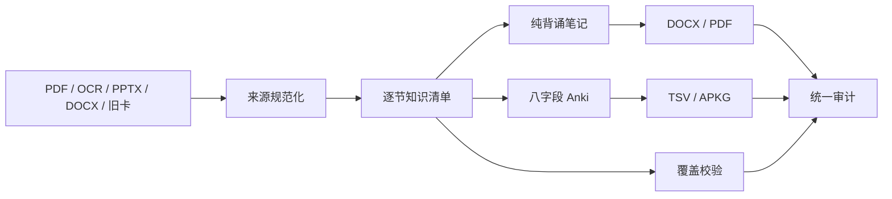

# Build Exam Anki

> 把 PDF、OCR、讲义和旧卡片变成可追踪、可审计、可长期迭代的背诵资产。

[](https://github.com/whiteOsky/build-exam-anki/actions/workflows/ci.yml)
[](https://github.com/whiteOsky/build-exam-anki/releases)
[](LICENSE)
[](SKILL.md)

`build-exam-anki` 是一个面向 Codex 的考试资料工程化技能。它把“让模型直接生成一批卡片”升级为一条带来源、覆盖证明和质量门禁的完整生产线：



## 核心能力

- **来源先行**：所有知识点先回到文件、页码或幻灯片号，再进入笔记和卡片。
- **逐节覆盖**：用独立小节清单和真实卡片 GUID 证明覆盖，不用卡片数量冒充完整度。
- **八字段卡片**：固定 `Front / Back / Extra / Mistake / Trigger / Importance / Source / Tags`。
- **稳定身份**：同一来源和问题生成稳定 GUID，适合后续升级牌组。
- **按章交付**：TSV 和 APKG 默认按章独立，便于控制学习负担与更新范围。
- **打印成品**：生成合并 DOCX/PDF，并要求逐页视觉复核公式、图片、空白和分页。
- **硬门禁**：来源、笔记、卡片、覆盖、APKG、打印版和视觉记录统一审计。
- **中文工作流**：命令帮助、错误信息、报告和技能说明均以中文为主。

## 直接下载现成牌组

不需要自己生成内容，也可以直接下载 [v1.1.0 公开牌组](https://github.com/whiteOsky/build-exam-anki/releases/tag/v1.1.0)。共 10 个学科牌组、12,458 张卡片，全部已清空原账户的学习进度，导入后从新卡片开始。

[下载全部牌组](https://github.com/whiteOsky/build-exam-anki/releases/download/v1.1.0/build-exam-anki-public-decks-v1.1.0.zip) | [查看牌组清单](decks/README.md)

牌组包括：数据结构、操作系统、计算机组成原理、计算机网络、高等数学及强化、线性代数及强化、概率论及强化。

## 产品边界

模型负责理解教材、提取语义、设计笔记和制卡；仓库内脚本负责确定性的清洗、校验、打包、打印和审计。它不是脱离模型的一键内容生成器，也不会用正则表达式替代学科判断。

## 安装

### 方式一：克隆后安装（推荐）

```bash
git clone https://github.com/whiteOsky/build-exam-anki.git
cd build-exam-anki
python3 tools/install.py
```

该安装器默认写入 `${CODEX_HOME:-$HOME/.codex}/skills/build-exam-anki`，只复制技能运行文件，并在技能目录创建隔离的 `.venv`。已有安装不会被静默覆盖；升级时显式执行：

```bash
git pull
python3 tools/install.py --force
```

### 方式二：Codex 官方技能安装器

```bash
python3 "${CODEX_HOME:-$HOME/.codex}/skills/.system/skill-installer/scripts/install-skill-from-github.py" \
  --repo whiteOsky/build-exam-anki \
  --path . \
  --name build-exam-anki
```

官方安装器会复制完整仓库但不会安装 Python 依赖。首次使用时，技能会按 `SKILL.md` 创建 `.venv` 并安装 `requirements.txt`。

## 环境要求

| 能力 | 必需组件 |
|---|---|
| 笔记与 TSV 校验 | Python 3.9+ |
| APKG 打包 | `genanki==0.13.1`，安装器会自动安装 |
| DOCX/PDF 打印 | Pandoc、Chrome 或 Chromium |
| PDF 自动审计 | Poppler：`pdfinfo`、`pdftotext`、`pdftoppm` |

macOS 可安装打印依赖：

```bash
brew install pandoc poppler
```

Ubuntu/Debian 可安装：

```bash
sudo apt-get install pandoc poppler-utils chromium-browser
```

## 快速开始

在新的 Codex 对话中直接发送：

```text
请调用 build-exam-anki 技能处理我提供的课程资料。
先建立逐节来源清单，再生成纯背诵笔记、按章独立的八字段 Anki、覆盖报告和合并打印版。
不要省略定义、条件、公式、性质、二级结论和易错边界；遇到选择直接采用技能推荐方案。
```

技能会建立如下课程项目：

```text
课程项目/
├── source/        # 原始 PDF、OCR、旧卡片
├── cleaned/       # 保守清洗后的 Markdown
├── notes/         # 分章纯背诵笔记
├── cards/         # 分章 TSV 与 APKG
├── reports/       # 覆盖、统计、索引、存疑、视觉复核
├── print/         # 合并 DOCX 与 PDF
├── assets/        # 章首页、思维导图等资源
└── build/         # 来源清单、逐节清单和临时检查产物
```

## 最小示例

[`examples/minimal-project`](examples/minimal-project) 提供一个不含真实教材内容的四卡片示例。安装依赖后可验证并打包：

```bash
python3 -m venv .venv
.venv/bin/python -m pip install -r requirements.txt
.venv/bin/python scripts/validate_notes.py examples/minimal-project/notes/第1章_进程状态_纯背诵版.md
.venv/bin/python scripts/validate_cards.py examples/minimal-project/cards/示例课程_第1章_Anki.tsv
.venv/bin/python scripts/build_apkg.py \
  examples/minimal-project/cards/示例课程_第1章_Anki.tsv \
  --output examples/minimal-project/cards/示例课程_第1章_Anki.apkg \
  --deck '示例课程::第1章'
.venv/bin/python scripts/build_reports.py \
  --project examples/minimal-project \
  --coverage reports/覆盖表.tsv
```

## 质量保证

```bash
python3 -m unittest discover -s tests -p 'test_*.py' -v
python3 tools/check_public.py
python3 tools/package_release.py
```

测试覆盖路径安全、原子写入、中文 CLI、公式定界符、八字段约束、稳定 GUID、APKG 内部结构、覆盖证明、打印构建和统一审计。GitHub Actions 会在 Python 3.9、3.11 和 3.12 上运行。

## 隐私与安全

- 原始教材默认只读，不会上传到第三方服务。
- 公开仓库不包含个人课程文件、真实卡片、绝对路径、令牌或构建缓存。
- 运行前仍应确认所使用教材和题目资料的版权边界。
- MIT 许可证适用于仓库代码；公开牌组内容的使用边界见 [NOTICE.md](NOTICE.md)。
- 安全问题请按 [SECURITY.md](SECURITY.md) 私下报告。

## 参与贡献

请先阅读 [CONTRIBUTING.md](CONTRIBUTING.md)。版本变化记录在 [CHANGELOG.md](CHANGELOG.md)。

## 许可证

[MIT](LICENSE)
